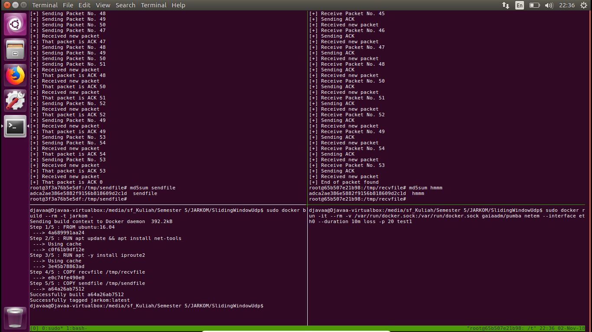

# Sliding Window Protocol with UDP

## 1. Anggota Kelompok
Muhammad Abdullah Munir - 13516074
Senapati Sang Diwangkara - 13516107
Restu Wahyu Kartiko - 13516155

## 2. Petunjuk Penggunaan Program
#### Receiver
```
./recvfile <filename> <windowsize> <bufferlength> <port_to_open>
```

#### Sender
```
./sendfile <filename> <windowsize> <bufferlength> <receiver_ip> <receiver_port>
```


## 3. Cara Kerja Sliding Window
### Sender
Sender memiliki dua thread, yaitu satu thread sebagai program untuk mengirim paket, dan thread kedua
sebagai penerima ACK dari receiver. 
Yang pertama kali dilakukan sender adalah membaca file yang ingin dikirim kedalam buffer.
Lalu sender mengirim paket ke Reciever sesuai ukuran sliding window yang ditentukan.
Sender akan menunggu balasan ACK dari Reciever.
Timeout untuk setiap paket yang dikirim adalah 2 detik dan jika sender belum menerima ACK dalam itu, maka paket dianggap "loss" dan sender akan mengirim ulang paket tersebut.
Jika paket paling kiri dari sliding window sender sudah menerima ACK dan valid sesuai validasi checksum, sliding window pada sender akan bergeser dan paket tersebut akan dikeluarkan dari buffer sender.
Sender akan mengirim paket terakhir yang panjang nya = 0 sebagai penanda End of Transmission.

### Reciever
Reciever hanya terdiri dari satu thread saja.
Reciver akan menunggu paket datang yang dikirm Sender.
Paket yang diterima akan di validasi menggunakan algoritma checksum.
Jika valid, dan sequence number berada pada sliding window, maka Reciver mengirim ACK ke Sender.
Jika tidak valid, maka Reciver mengirim NACK ke Sender.
Saat Reciever menerima paket yang panjangnya = 0, maka program di terminasi.
Receiver akan menuliskan ke file stream setiap setelah data yang disimpan secara sequential di buffer sudah sebanyak buffersize.

## 4. Penjelasan Fungsi
isValid | packet.cpp : mengembalikan valid jika checksum pada paket sama dengan checksum hasil hitungan.
checksum | packet.cpp : mengembalikan hasil penghitungan nilai checksum suatu paket.
openFile | reciever.cpp : membuka suatu file.
writeFile | reciever.cpp : menuliskan data pada buffer di reciver ke file.
closeFile | reciever.cpp : menutup file.
sendack | reciever.cpp : mengirim ack sesuai parameter address.
listen | reciever.cpp : menunggu paket dari sender, dan melakukan proses validasi hingga pengiriman ack ke sender.
openFile | sender.cpp : membuka suatu file.
readFile | sender.cpp : membaca suatu file ke file stream.
closeFile | sender.cpp : menutup file.
fillBuffer | sender.cpp : mengisi buffer pada sender dengan input file stream.
slider | sender.cpp : implementasi sliding window pada sender.
listener | sender.cpp : menerima ACK dan menerima NACK. Jika menerima NACK, maka paket dikirim ulang.

Sisa fungsi yang ada adalah getter dan setter untuk tiap atribut pada class

## 5. Pembagian Tugas
13516074 : UDP base code, sender sliding window
13516107 : Receiver sliding window
13516155 : Laporan dan per-CP-an

## 6. Screenshot
